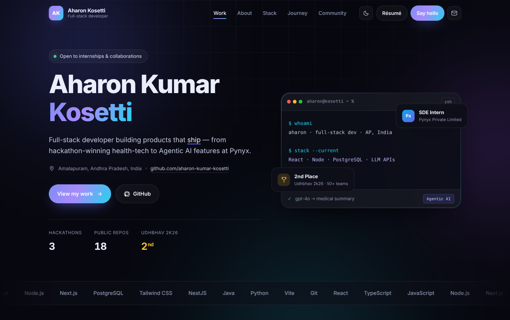

<!-- ════════════════════════════════════════════════════════════════════════ -->
<!--  Aharon Kumar Kosetti · GitHub profile README                            -->
<!--  Palette: indigo #6366F1 · violet #A855F7 · cyan #22D3EE · slate #94A3B8 -->
<!-- ════════════════════════════════════════════════════════════════════════ -->

<div align="center">


<br />

<a href="https://github.com/aharon-kumar-kosetti?tab=repositories">
  
</a>

<br />

<a href="https://aharonkosetti.vercel.app"></a>&nbsp;
<a href="https://aharonkosetti.vercel.app/Aharon-Kosetti-Resume.pdf"></a>&nbsp;
<a href="mailto:kaharonkumar@gmail.com"></a>

<br /><br />

&nbsp;
&nbsp;


</div>

<br />

> **Full-stack developer building products that ship** — from hackathon-winning health-tech to
> Agentic AI features at Pynyx. Student by roll number, engineer by commit count.

---

## 🖥️ This repo also ships my portfolio site

A dependency-free, single-page portfolio — **HTML + CSS + vanilla JS**, no build step.



| | |
|:---|:---|
| 📄 | [`index.html`](index.html) — the page |
| 🎨 | [`assets/styles.css`](assets/styles.css) — design tokens, glass surfaces, responsive layout |
| ⚙️ | [`assets/app.js`](assets/app.js) — scroll reveals, spotlight cards, animated terminal, counters |
| 🌗 | Dark **and** light theme with a persisted toggle |
| 📱 | Fully responsive: mobile nav, fluid type, reduced-motion friendly |

**Run it locally:**

```bash
git clone https://github.com/aharon-kumar-kosetti/aharon-kumar-kosetti.git
cd aharon-kumar-kosetti
python3 -m http.server 3000      # then open http://localhost:3000
```

> Live site: **[aharonkosetti.vercel.app](https://aharonkosetti.vercel.app)** ·
> Light-theme screenshot: [`preview-light.png`](preview-light.png)

---

## 🧑‍💻 About me

I'm a **Computer Science & Design** undergraduate at **SRKR Engineering College** and a
**Software Development Engineer intern at Pynyx Private Limited**, where I build full-stack
applications and AI-powered features with LLMs and Agentic AI workflows.

My happy place is the intersection of product and engineering — hackathons like **MediVault**
(2nd place, Udhbhav 2k26) and **Blood Link** taught me to ship working software under real
deadlines, with secure auth, role-based access and data models that put users first.

Right now I'm deepening my craft in **system design, testing with Vitest and CI/CD** — and grinding
DSA daily for that future SDE role.

| | |
|:---|:---|
| 🎓 | B.Tech Computer Science & Design, 2025 – 2029 (expected) · **CGPA 8.5** |
| 🏢 | SDE Intern at **Pynyx Private Limited** (Jul 2026 – Present) |
| 🏆 | **2nd place** — Udhbhav 2k26, competing against 50+ teams |
| 🌱 | Learning: system design · advanced PostgreSQL · agentic LLM orchestration |
| 🤝 | Open to internships, collaborations and honest code reviews |
| 📬 | [kaharonkumar@gmail.com](mailto:kaharonkumar@gmail.com) |

---

## 🚀 Selected work

### 🩺 MediVault &nbsp;·&nbsp; `2nd place · Udhbhav 2k26`

Patient-owned digital health records platform with encrypted vaults, consent governance,
emergency access and GPT-4o AI summaries — removing single-provider lock-in.

- Patient-owned data model giving users control over **100% of their medical records**
- **GPT-4o** integration auto-summarises medical history for clinicians
- 3-tier architecture with role-based access control · secure storage on **Appwrite**


[](https://medivault-zeta-seven.vercel.app/)
[](https://github.com/aharon-kumar-kosetti/medivault)

<br />

### 🩸 Blood Link &nbsp;·&nbsp; `Hackoverflow 2k25 · built in 24 hours`

Real-time blood donation and management system connecting donors, recipients and blood banks —
built overnight with team **Code Avengers**.

- Real-time matching on **blood group + location**
- Centralised dashboard tracking inventory across donation centres


[](https://blood-link-alpha.vercel.app/)
[](https://github.com/aharon-kumar-kosetti/Blood-Link)

<br />

### 🗂️ Project Nexus

Full-stack project command centre for planning, tracking and deploying software — kanban workflow,
secure auth, document uploads and role-based access.


[](https://github.com/aharon-kumar-kosetti/Project-Nexus)

<br />

### 📆 DSA-365-Days &nbsp;·&nbsp; `a year of daily commits`

Data structures and algorithms in Java — clean code, optimal approaches and interview preparation,
one push at a time.


[](https://github.com/aharon-kumar-kosetti/DSA-365-Days)

<br />

<div align="center">

[](https://github.com/aharon-kumar-kosetti?tab=repositories)

</div>

---

## 🛠️ Tech stack

| | Stack |
|:---:|:---|
| **Languages** |       |
| **Frontend** |       |
| **Backend** |      |
| **Data & Infra** |       |
| **Practices** |      |

<sub>**Currently learning:** system design patterns · advanced PostgreSQL · agentic LLM orchestration — applied daily at work and in side projects.</sub>

---

## 💼 Experience & education

<table>
<tr>
<td width="60%" valign="top">

**Software Development Engineer Intern** · *Pynyx Private Limited*
`Jul 2026 — Present`

- Developing full-stack applications across frontend and backend, integrating REST APIs, databases and third-party services
- Building AI-powered features with LLMs, contributing to Agentic AI and intelligent automation initiatives
- Testing, debugging and optimising for performance, scalability and reliability
- Collaborating with engineering teams; documented **5+ technical workflows**

</td>
<td width="40%" valign="top">

**B.Tech — Computer Science & Design** · *SRKR Engineering College, Bhimavaram*
`2025 — 2029 (expected)`

- **CGPA: 8.5**
- Focus: DSA in Java, DBMS, system design fundamentals

</td>
</tr>
</table>

---

## 📊 GitHub in numbers

<div align="center">


&nbsp;&nbsp;


<br /><br />


<br /><br />


</div>

<div align="center">

| 🏆 2nd place | 📦 18 | 🧑‍💻 3 | ✍️ 254 |
|:---:|:---:|:---:|:---:|
| Udhbhav 2k26 (50+ teams) | public repositories | hackathons & counting | total commits |

</div>

---

## 🌐 Everywhere I create

<div align="center">

<a href="https://github.com/aharon-kumar-kosetti"></a>
<a href="https://www.linkedin.com/in/aharon-kumar-kosetti/"></a>
<br />
<a href="https://www.instagram.com/theaharonkosetti/"></a>
<a href="https://www.youtube.com/@AharonKosetti"></a>
<a href="https://leetcode.com/u/aharonkosetti/"></a>
<a href="https://aharonkosetti.vercel.app"></a>

</div>

---

<div align="center">

### Let's build something worth shipping 🚀

I'm open to **internships, collaborations and interesting problems** — whether it's a full-stack
product or an AI-driven feature, my inbox is always open.

[](mailto:kaharonkumar@gmail.com)

<br />


*"First, solve the problem. Then, write the code."*

</div>
